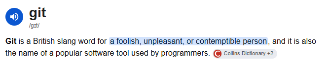

## 

{fig-align="center"}

## What you gonna Git out of this??

 * In about 5 minutes I will try explain:
 * What Git and GitHub are
 * Why it might be more than just storing code
 * I am going to try keep this very low-tech
 
{fig-align="center"}
 
## What is Git??

 * Git is software which tracks changes in code
 * Create checkpoints known as **commits**
 * Create **branches** for safe experimentation
 * **Merge** changes into your main branch

 
 {fig-align="center"}

## GitHub?? GitLab?? GitLost??
 
 * GitHub, GitLab, BitBucket are all flavours of the same thing
 * Host your code online for storage and sharing
 * Free, student, premium and enterprise versions
 * Offer project management and code quality tooling
 
  {fig-align="center"}
  
  
## What can I Git out of GitHub??

 * Collaboration: code review, open source, licensing
 * Project management: issues, boards, discussions
 * CI/CD: run automated checks on your code
 * Wikis: documentation, SOPs, FAQs, ...
 

 {fig-align="center"}

## What is this Git trying to get across??

 * Git is version control software
 * GitHub is an online platform for managing code projects
 * You can use CLI and GUIs for Git
 * Start off small, the fancy stuff can come later
 
{fig-align="center"}